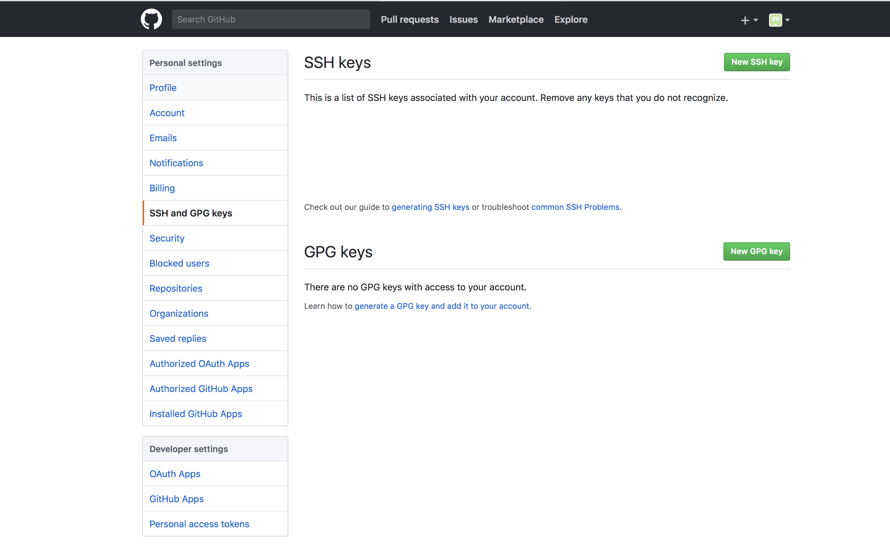

# Github

***

## 申请Github账号

​        登陆 <www.github.com> 申请账号

***

## 利用Git创建本地仓库和远程仓库

* 从[Git官网](https://git-scm.com/downloads)下载git**对应版本**，并在安装成功后通过'git —version'检验是否安装成功

  ~~~
      git --verison      
  ~~~

* 成功后对本地设置用户及用户邮箱 

         ​~~~
       git config --global user.name "your_name"  
       git config --global user.email "your_email@gmail.com"
         ​~~~

* 接下来对配置对应Github账号的SSH密钥

  Git关联远端仓库时候需要提供公钥，本地保存私钥，每次与远端仓库交互时候，远端仓库会用公钥来验证交互者身份。*使用以下指令生成密钥*。

  ~~~
  ssh-keygen -t rsa -C "your_email@youremail.com"
  ~~~

  生成的SSH密钥存储在／Users／用户／.ssh 文件中通过以下指令查询密钥。

  ~~~
  $ cd .ssh
  $ cat id_rsa.pub
  ~~~

* 远程仓库添加密钥

  设置Github用户中的settings，在SSH and GPG keys中添加之前查询所得的密钥。

  ​

  

​                                                                       添加密钥

* 创建本地仓库并连接远程仓库

   在终端中依次执行以下指令：

  ~~~
    git init    #初始化本地仓库
    git clone 'url'     #目标Github的SSH链接  
  ~~~

  接下来可以对内容进行修改，当修改完完毕后需要对信息进行提交，通过add将修改文件加入暂存区，并通过commit进行信息提交，具体指令如下：

  ~~~
  git add <文件>    # 括号中填修改过的文件
  git add .     #添加所有修改文件，与第一条指令同作用

  git commit -m. '本次修改信息’     #提交本次修改
  ~~~

  当提交完修改后通过push将修改的信息从本地仓库关联到远程仓库。

  ~~~
  git push origin dev.  #origin 为远程主机名 可通过 git branch -r 查询，dev为本地仓库名
  git branch -vv       # 可查询本地仓库的列表
  ~~~

   此时已经成功将本地修改信息同步到远程仓库中，登陆Github中可以看到更新的内容，关于branch[^详细]。

[^详细]: branch用于仓库的切换

   

  ​

  ​

  ​
