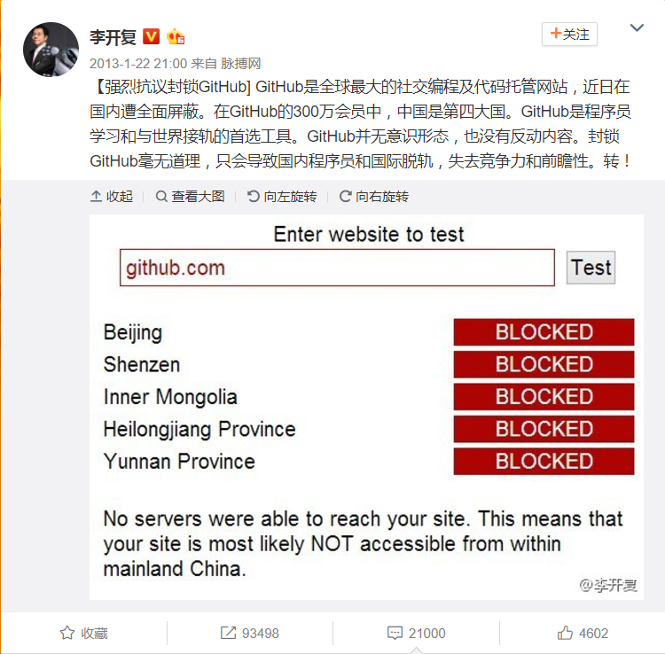

#  第一周技术报告

第一周的目标是通过网络资源完成Github、Git的基础功能和Markdown的基本语法学习。

接下来是三个功能的实现，最后是我自己在学习过程中的Q&A。

## Github

### 1.简介

Github说到底是基于git的版本托管服务，也是全球最大的开源软件。

### 2.历史

当然2013年Github也曾遇到了地区性的不可抗力。

### 3.Github的基本功能

[官方”10“分钟快速入门](https://guides.github.com/activities/hello-world/)

## Git

Git 是一款免费、开源的分布式版本控制系统, 当然他是由Linux 发明者 Linus 开发。

#### 1. 从本地开发，Github里面没有作为开发基础的仓库

- 在命令行 输入 `git` 可以得到Git的常用命令和含义。

- 通过`git status`查看状态，可以清晰地知道仓库里面的文件有没有被跟踪。

- ----

  通过`cd 目录名`找到你创建的本地文件名(文件什么的，你还是自己鼠标创建吧）。

- 通过`git init`初始化你的文件，使之变成仓库。

- ----

  通过`git branch`可以查看当前分支情况，例如有几个不同命名的分支。

- 通过`git branch a`可以建立一个新的分支a。

- 通过`git checkout`可以切换当前处理的分支。

- 通过`git checkout a`跳到a分支去工作

- 把上面四步合并，就变成了`git checkout -b a`新建a分支，然后自动切换到a分支

- ----

  当你在分支上完成了阶段性任务后，你就可以在本地合并a分支和master分支

- 先通过`git checkout master`回到主分支，然后`git merge a`进行合并。

----

**接下来就是进行本地仓库管理的过程**

-------

git项目仓库示意图：

根据上图，我们可以更好地理解下面两个命令。

1. `git add` :把你已经修改完毕的文件添加到暂存区（staging area）

2. `git commit`:正式提交更改

3. `git commit -m "first commit`：提交时，同时给这次更改命名“first commit”。

最后，通过`git log`可以查看所有commit的记录，你也可以为你每次commit命名。

-----------------------------------------------

**接下来是本地仓库和远程仓库（也就是GitHub上的仓库）之间的互动。**

当然SSH key也是很重要的，隔壁技术报告中有提到，这里就不在赘述了。

--------------------------------

- `git push origin master`是把你的本地代码推到远程仓库去，实现同步。
- `git pull origin master`是把远程仓库里最新的代码拉下了，实现同步。

#### 2.以Github上面的项目为基础开发（主要是这个）

- `git clone git@github.com:Galileo-Bill/hello-world.git`

​	把需要的项目克隆下来。

- 在你目录里修改文件，然后add，commit，最后git push origin master

如果你想上传的远程仓库和你克隆下来的不一样，那么改一下origin。

- `git remote add origin git@github.com:Peter/hello-world.git`

#### 3.  小技巧

别名的运用（和c++里面的差不多）

- `git config --global alias.co checkout`
- 把co当作checkout的别名

git flow的运用（一种成熟的工作管理流程）

## Markdown

[简单入门](http://www.jianshu.com/p/q81RERV)

PS.我自己以后写技术报告，还要学LaTex，来满足数学公式的输入。

## Q & A

1. 为什么要学命令行而不是直接用Github Desktop（一个官方的图形界面软件）？

   ​	 我一开始是打心眼里是反对的，有更好更简便更好看的软件不用，去接触命令行，

   这不是我心中完成任务的最短捷径。但正因为是捷径，当你在羊肠小道上狂飙突进时，

   一旦走进岔路，你就不能像那些熟悉Git命令行的老司机娴熟地拿出地图，快速诊断问题，

   迅速解决。因此，当你对Git的每一步操作都能理解其意义时，你想用任何图形化的软件

   都没问题。

2. 如果我fork一个项目这时候原repository更新了，我怎么同步？ 

   [两种方案](https://jinlong.github.io/2015/10/12/syncing-a-fork/)

   ​

